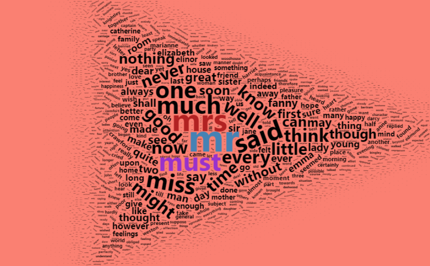
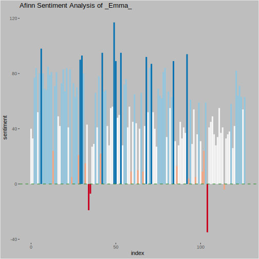

README
================
2021-06-18

<!-- README.md is generated from README.Rmd. Please edit that file -->

## Text Mining: Sentiment analysis and word clouds

<!-- badges: start -->
<!-- DOI all versions:  10.5281/zenodo.4908863 -->

[-blue "DOI")](https://doi.org/10.5281/zenodo.4908863)

<!-- badges: end -->

### Recording

<iframe width="560" height="315" src="https://www.youtube.com/embed/8ISc8V9GDAg?si=iErWIj6F82aFWIV1" title="YouTube video player" frameborder="0" allow="accelerometer; autoplay; clipboard-write; encrypted-media; gyroscope; picture-in-picture; web-share" allowfullscreen></iframe>

### Install Packages

    install.packages(c("tidyverse", "tidytext", "janeaustenr", "wordcloud2"))

### Process

1.  Get data

2.  Wrangle Data

3.  Tokenize corpus

4.  Generate word clouds

5.  Join with sentiment dictionaries

6.  Visualize sentiment

### Resources

-   [Tidytext package](https://juliasilge.github.io/tidytext/)
-   Book: [Text Mining with R](https://www.tidytextmining.com/) by Silge
    and Robinson
-   Data Wrangling with dplyr:
    ([video](https://juliasilge.github.io/tidytext/) \|
    [workshop](https://rfun.library.duke.edu/portfolio/r_flipped/))
-   Data Visualization with ggplot2:
    ([video](https://warpwire.duke.edu/w/80YEAA/) \|
    [workshop](https://rfun.library.duke.edu/portfolio/ggplot_workshop/))

