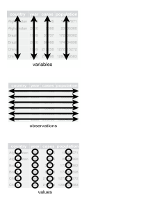
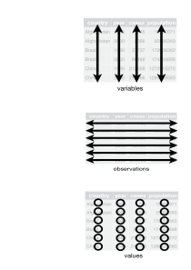

```{r setup, include=FALSE}
options(htmltools.dir.version = FALSE)
library(tidyverse)
library(htmltools)
tagList(rmarkdown::html_dependency_font_awesome())
# library(xaringanthemer)  # run once; or use the pre-run css found in mystyles (xaringan-themer.css)
# style_duo_accent(
# primary_color = "#012169",
# secondary_color = "#005587",
# header_font_google = google_font("Josefin Sans"),
# text_font_google = google_font("Montserrat", "300", "300i"),
# code_font_google = google_font("Fira Mono")
# )
```

## Packages for today

_Sentiment Analysis:  R case study_  

.bg-washed-blue.b--navy.l-10.t-20pct.w-90.ba.bw2.br3.shadow-5.ph4.mt5[
`install.packages(c("tidyverse", "tidytext",`<br> &nbsp; &nbsp; &nbsp; &nbsp; &nbsp; &nbsp; &nbsp; &nbsp; &nbsp; &nbsp; &nbsp; &nbsp; &nbsp; &nbsp; &nbsp; &nbsp; &nbsp;`"janeaustenr", "wordcloud2"))`
]  

.l-60.t-80pct.fl-w-third[
```{r echo=FALSE}
countdown::countdown(20)
```
]

---

## Duke University: Land Acknowledgement

.f3[I would like to take a moment to honor the land in Durham, NC.  Duke University sits on the ancestral lands of the Shakori, Eno and Catawba people. This institution of higher education is built on land stolen from those peoples.  These tribes were here before the colonizers arrived.  Additionally this land has borne witness to over 400 years of the enslavement, torture, and systematic mistreatment of African people and their descendants.  Recognizing this history is an honest attempt to breakout beyond persistent patterns of colonization and to rewrite the erasure of Indigenous and Black peoples.  There is value in acknowledging the history of our occupied spaces and places.  I hope we can glimpse an understanding of these histories by recognizing the origins of collective journeys.]


---

layout: true

.footercc[
<i class="fab fa-creative-commons"></i>&nbsp; <i class="fab fa-creative-commons-by"></i><i class="fab fa-creative-commons-nc"></i>  <a href = "https://JohnLittle.info"><span class = "opacity30">https://</span>JohnLittle<span class = "opacity30">.info</span></a> 
<span class = "opacity30"> | <a href="https://github.com/libjohn/workshop_textmining">https://github.com/libjohn/workshop_textmining</a> | `r Sys.Date()` </span>
]

---

## Demonstration Goals

- Data _cleaning_ & data _wrangling_

- Tokenize corpora (unit of analysis)

- Visualize word clouds (novelty)  

- Sentiment analysis ()

- Analyzing word frequencies (tf-idf)


***

.f6.i.moon-gray.center[This is not a text analysis workshop.  The foundations of text analysis require considerably more time that we have.  
This is a demonstration on leveraging tidy packages (tidyverse and tidytext) and sharing resources.  ]


---

class: img-right-full

# _Text Mining with R_ 


#### by Silge & Robinson 


- [www.tidytextmining.com](https://www.tidytextmining.com/)  

- [juliasilge.github.io/tidytext](https://juliasilge.github.io/tidytext/)  

- [github.com/juliasilge/janeaustenr](https://github.com/juliasilge/janeaustenr)


---

class: img-left-full  
layout: false  



# Tidy data

- Each variable is a column  

- Each observation is a row  

- Each type of observational unit is a table  

.footer.center[.f6[-- Wickham 2014  ]  ]

.footercc[  [Tidy data. Chapter 12. _R for Data Science_](https://r4ds.had.co.nz/tidy-data.html) by Wickham & Grolemund]

---

class: img-right-full  



# Tidy Text format

- A token is a meaningful unit of text

- Tokenization is the process of splitting text into tokens `tidytext::unnest_tokens()`

- A table with **one-token-per-row**

.footer[.f6[  &nbsp; -- Silge & Robinson] ]


---
class: col-2  

# Other data structures  

#### String  

Text / character vectors


#### Corpus  
Raw strings annotated with additional metadata  

#### Document-term matrix

A sparse matrix describing a collection of documents (i.e. _corpus_) with one row for each document and one column for each term. (tf-idf)


.footer[.f6[ &nbsp; -- Silge & Robinson]] 

---

layout: true

.footercc[
<i class="fab fa-creative-commons"></i>&nbsp; <i class="fab fa-creative-commons-by"></i><i class="fab fa-creative-commons-nc"></i>  <a href = "https://JohnLittle.info"><span class = "opacity30">https://</span>JohnLittle<span class = "opacity30">.info</span></a> 
<span class = "opacity30"> | <a href="https://github.com/libjohn/workshop_textmining">https://github.com/libjohn/workshop_textmining</a> | `r Sys.Date()` </span>
]


---

# Other packages <sup>✤</sup>

- [tm](https://tm.r-forge.r-project.org/) -- _Text Mining Infrastructure in R_  

- [quanteda](https://quanteda.io/) -- _Package for managing and analyzing textual data_

- [gutenbergr](https://docs.ropensci.org/gutenbergr/) -- public domain text from **Project Gutenberg**


.footnote[.small[ ✤ Not covered in this case study]]


---

# Further study

Read more of [_Text Mining with R: A Tidy Approach_](https://www.tidytextmining.com)

1. The tidy text format
2. **Sentiment analysis with tidy data**
3. **Analyzing word and document frequency: tf-idf**
4. Relationships between words: n-grams and correlations
5. Converting to and from non-tidy formats
6. **Topic modeling** (unsupervised classification)
7. Case study: comparing Twitter archives<br>_plus more case studies_


---

# Further study

_Summer Institute for Computational Social Science_  
co-founded by [Chris Bail & Matthew Salganik](https://sicss.io/people)

[SICSS Text Analysis curriculum](https://sicss.io/curriculum)

---
layout: false
class:  middle, center

<br>

.bg-washed-blue.b--navy.ba.bw2.br3.shadow-5.ph4.mt5[


## John R Little

.prussian[
.f5[Data Science Librarian  
Center for Data & Visualization Sciences  
Duke University Libraries  
]
]

.f7[https://johnlittle.info  
https://Rfun.library.duke.edu  
https://library.duke.edu/data  
]
]


<i class="fab fa-creative-commons fa-2x"></i> &nbsp; <i class="fab fa-creative-commons-by fa-2x"></i><i class="fab fa-creative-commons-nc fa-2x"></i>  
.f6.moon-gray[Creative Commons:  Attribution-NonCommercial 4.0]  
.f7.moon-gray[https://creativecommons.org/licenses/by-nc/4.0]

